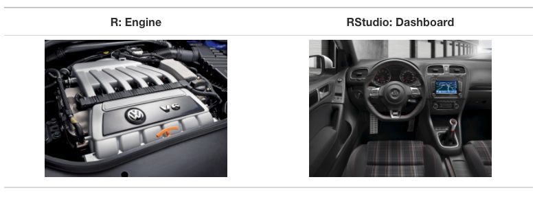
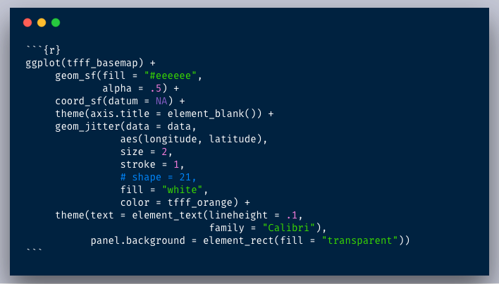
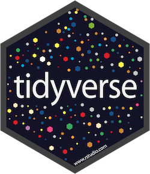

```{r setup, include=FALSE}
options(htmltools.dir.version = FALSE)
knitr::opts_chunk$set(
  fig.width=9, fig.height=3.5, fig.retina=3,
  out.width = "100%",
  cache = FALSE,
  echo = TRUE,
  message = FALSE, 
  warning = FALSE,
  hiline = TRUE
)
```

```{r xaringan-themer, include=FALSE, warning=FALSE}
library(xaringanthemer)
style_duo_accent(
  primary_color = "#1381B0",
  secondary_color = "#FF961C",
  inverse_header_color = "#FFFFFF"
)
```

## Install R

The first thing you need to do is download the R software. Go to the [Comprehensive R Archive Network (aka “CRAN”) website](https://cran.r-project.org/) and download the software for your operating system (Windows, Mac, or Linux).


---


### Working Directly in R


---

### Working Directly in R

1. Enter: 2 + 2

2. Hit return

3. View result

---


### Your Turn

1. Download and Install R

--

1. Open R

--

1. Use any mathematical operators (+, -, /, and *) to create an expression and make sure it works as expected


---


## RStudio
---

### Download RStudio

Download RStudio at the [RStudio website](https://www.rstudio.com/products/rstudio/download/#download). Ignore the various versions listed there. All you need is the latest version of RStudio Desktop.


---


### Tour of RStudio

.center[


--

.center[



---

### RStudio

If you use RStudio, you’ll have a graphical user interface, the ability to see all of your stored information, and much more.


---

### Your Turn

1. Download and Install RStudio

--

1. Open RStudio

--

1. Working in the console pane, use any mathematical operators (+, -, /, and *) to create an expression and make sure it works as expected

---

class: center, middle, dk-section-title

background-image: url("images/projects.jpeg")

# Projects


--

Projects allow you to keep a collection of files all together, including: 

--

- R scripts

--

- RMarkdown files (more on those soon)

--

- Data files

--

- And much more!


---

### Sample Project

.center[


]

---


### How to Create a Project


1. File -> New Project

--

2. Quit RStudio, Double-click .Rproj file to reopen project

---

class:inverse

### Your Turn

1. Create a new project (doesn't matter if it's in a new or existing directory)

--

2. Quit RStudio, double-click the .Rproj file and reopen your project

---


class: center, middle, dk-section-title

background-image: url("images/download-course-project.jpeg")

# Download Course Project

---

class: inverse

## Your Turn

--


# Files in R

---


## File Types

There are **two main file types** that you'll work with: 

.pull-left[
**R scripts (.R)**
]

--

.pull-right[

**RMarkdown files (.Rmd)**

Text is assumed to be text unless you put it in a code chunk (more on this soon)



]


---

## R Scripts


Create new script file: File -> New File -> R Script


---


## How to Run Code

Run the code: control + enter on Windows,  command + enter on Mac keystrokes or use Run button


???

Note that you don't have to highlight code. 

You can just hit run anywhere on line to run code. 

---

## Comments

Do them for others, and for your future self. 

```{r eval = F}

# This is a comment

head(data, n = 5)

```

---
class: center, middle, dk-section-title

background-image: url("images/packages.jpg")

# Packages

---

## Packages

Packages add functionality that is not present in base R. 

They're where much of the power of R is found.

--

.center[


---

## Packages We'll Use throughout this training

.pull-left[

.center[



]

]


.pull-right[

### `tidyverse`

The [`tidyverse`](https://tidyverse.org/) is a collection of packages. 

We'll use [`readr`](https://readr.tidyverse.org/) to import data. 

]

---

## Packages We'll Use


.pull-left[

### `skimr`

[`skimr`](https://github.com/ropensci/skimr) provides easy summary statistics.

]


.pull-right[

.center[


]


]

---


## Install Packages

The syntax to install packages is as follows. 

```{r eval=F}
install.packages("tidyverse")
install.packages("skimr")
```

The package name must be in quotes.

--

.dk-highlight-box[
Packages should be installed **once per computer** (i.e. once you've installed a package, you don't need to do it again on the same computer).
]

---

## Load Packages

To load packages, use the following syntax:

```{r eval = T}
library(tidyverse)
library(skimr)
```

Package names don't need to be quoted here (though they can be).

--

.dk-highlight-box[
Packages should be loaded **once per session** (i.e. every time you start working in R, you need to load any packages you want to use). 
]


---


class:inverse

## Your Turn

1. Open the project you downloaded before (it should be on your desktop)

--

1. Open the exercises.R file

--

1. Install the tidyverse and skimr packages using the install.packages function

--

1. Load the tidyverse and skimr packages using the library function

---

class: center, middle, dk-section-title

background-image: url("images/data.jpg")


# Import Data


---

## Import Data

Let's read data from a CSV file. 


```{r eval = T, echo = F}
library(here)
faketucky <- read_csv(here("data", "faketucky.csv"))


```

```{r}

faketucky <- read_csv("data/faketucky.csv")


```

We now have a data frame/tibble called `faketucky` that we can work with in R.


???

- Tibbles are ["modern data frames"](https://cran.r-project.org/web/packages/tibble/vignettes/tibble.html). The main difference for our purposes is that tibbles print much more nicely within R. 

- We'll use the terms tibble and data frame interchangeably. 

- For Excel files, try `read_excel` from the `readxl` package. 

- For SPSS files, try `read_sav` from the `haven` package.


---


## R is Case Sensitive

R is **case sensitive** so choose one of the following for all objects and **be consistent**.
.pull-left[
**Option**

snake_case 

camelCase

periods.in.names
]

--

.pull-right[

**Example**

student_data

studentData

student.data
]


---


## Directories

If the data file is in the working directory, you only need to specify its name.

```{r}
faketucky <- read_csv("faketucky.csv")
```

--

If the data file is not in the working directory, you need to specify full path name. 

--

When specifying the path name use of forward slash (“/”) not backslash (“\”).

```{r}
faketucky <- read_csv("data/faketucky.csv")
```

---

## Where Does our Data Live?

Data we have imported is available in the environment/history pane.

.center[

]

---
class:inverse

## Your Turn

1. Open the exercises.R file

--

1. Import the faketucky data into a data frame called `faketucky`.

--

1. Make sure you see `faketucky` in your environment/history pane.

---
class: center, middle, dk-section-title

background-image: url("images/function.jpg")


# Objects and Functions

---

## Objects and Functions

--

> To understand computations in R, two slogans are helpful:

--

> Everything that exists is an **object**, and 

--

> Everything that happens is a **function** call.

--

John Chambers, quoted in [Hadley Wickham's Advanced R](http://adv-r.had.co.nz/Functions.html).


---

## Objects and Functions

.center[]


---

## Assignment Operator

.center[
  
]

--

We assign the result of the `read_csv` **function** to the `faketucky` **object**
---
class: center, middle, dk-section-title

background-image: url("images/glasses.jpeg")


# Examine Our Data


---

## Examine Our Data

There are many ways to look at our data. We'll talk about a few.


---

## `faketucky`

If you type the name of your data frame (i.e. `faketucky`), R will output the following: 
```{r}
faketucky
```

--

```{r eval = T, paged.print = F, echo = F}
faketucky
```

---

## `head`

`head` shows us the first X rows. 
```{r}
head(faketucky, 5)
```

--

```{r eval = T, paged.print = F, echo = F}
head(faketucky, 5)
```

---

## `head`

```{r}
head(faketucky, 5)
```

--

.dk-highlight-box[
`faketucky` and the number 5 here are **arguments**.
]

---

## `tail`

`tail` shows us the last X rows. 
```{r}
tail(faketucky, 5)
```

--

```{r eval = T, paged.print = F, echo = F}
tail(faketucky, 5)
```

---

## `View`

`View` (note capital V) opens the RStudio viewer (or click on a data frame in the environment pane).

```{r paged.print = F}
View(faketucky)
```

---


## `skimr`

The skimr package provides more detailed information about our data frame. It is also broken up by the type of variable.

```{r}

skim(faketucky)

```

--

```{r eval = T, paged.print = F, echo = F}

skim(faketucky)

```

---

class:inverse

## Your Turn

1. Open the file exercises.R

--

1. Follow the instructions to use the `head()`, `tail()`, `View()`, and `skim()` functions to examine your data.

---

class: center, middle, dk-section-title

background-image: url("images/issues.jpeg")

# We've Got Issues!

---

## We've Got Issues!

Several variables have max values of 999. This seems suspicious!


---

## We've Got Issues!

Several variables show up as numeric, but we know they're **not actually numeric**.


---

## Let's Import Our Data Again

We need to do two things:


--

1. Tell `read_csv` how to handle **missing data**

--

1. Make sure `read_csv` assigns the correct **data type** to each variable


---


## Missing Data

Here's how we imported our data the first time:

```{r}
faketucky <- read_csv("data/faketucky.csv")
```

--

To tell R which data is missing, simply add an argument to the `read_csv` function as follows:

```{r}
faketucky <- read_csv("data/faketucky.csv",
                     na = "999") #<<
```

```{r eval = T, echo = F}
faketucky <- read_csv(here("data", "faketucky.csv"),
                      na = "999") 

```


---

## Missing Data

If we skim our data again, we'll see that there are no longer 999 values. 

```{r}
skim(faketucky)

```

???

Do this in R


---

## Data Types

When you run `read_csv` you'll see the following message, which tells you the data types that have been assigned to your data frame.

--


class:inverse

## Your Turn

1. Open the file exercises.R and change the code so that you correctly import the `faketucky` data frame, telling `read_csv` which data is missing and explictly defining column types where necessary.

--

1. After you make changes to how you import your data, rerun the code in the Examine Data section to make sure everything worked!

---


class: center, middle, dk-section-title

background-image: url("images/help.jpeg")

# Getting Help

---

### ?function

Use the ? to get help about anything you're confused about

```{r}

?read_csv

```

---

## Tidyverse Website

[](https://www.tidyverse.org/)

---


## Package Vignettes

[](https://cran.r-project.org/web/packages/skimr/vignettes/Using_skimr.html)

---

## Twitter

[](https://twitter.com/search?q=%23rstats)

---

## R for Data Science Community

[](https://www.rfordatasci.com/)

---

## Google

[](https://twitter.com/ekaleedmiston/status/1081221822186696706)


## Typography

Text can be **bold**, _italic_, ~~strikethrough~~, or `inline code`.

[Link to another slide](#colors).

### Lorem Ipsum

Dolor imperdiet nostra sapien scelerisque praesent curae metus facilisis dignissim tortor. 
Lacinia neque mollis nascetur neque urna velit bibendum. 
Himenaeos suspendisse leo varius mus risus sagittis aliquet venenatis duis nec.

- Dolor cubilia nostra nunc sodales

- Consectetur aliquet mauris blandit

- Ipsum dis nec porttitor urna sed

---
name: colors

## Colors

.left-column[
Text color

[Link Color](#3)

**Bold Color**

_Italic Color_

`Inline Code`
]

.right-column[
Lorem ipsum dolor sit amet, [consectetur adipiscing elit (link)](#3), 
sed do eiusmod tempor incididunt ut labore et dolore magna aliqua. 
Erat nam at lectus urna.
Pellentesque elit ullamcorper **dignissim cras tincidunt (bold)** lobortis feugiat. 
_Eros donec ac odio tempor_ orci dapibus ultrices. 
Id porta nibh venenatis cras sed felis eget velit aliquet.
Aliquam id diam maecenas ultricies mi.
Enim sit amet 
`code_color("inline")`
venenatis urna cursus eget nunc scelerisque viverra.
]

---

# Big Topic or Inverse Slides `#`

## Slide Headings `##`

### Sub-slide Headings `###`

#### Bold Call-Out `####`

This is a normal paragraph text. Only use header levels 1-4.

##### Possible, but not recommended `#####`

###### Definitely don't use h6 `######`

---

# Left-Column Headings

.left-column[
## First

## Second

## Third
]

.right-column[
Dolor quis aptent mus a dictum ultricies egestas.

Amet egestas neque tempor fermentum proin massa!

Dolor elementum fermentum pharetra lectus arcu pulvinar.
]

---
class: inverse center middle

# Topic Changing Interstitial

--

```
class: inverse center middle
```

---
layout: true

## Blocks

---

### Blockquote

> This is a blockquote following a header.
>
> When something is important enough, you do it even if the odds are not in your favor.

---

### Code Blocks

#### R Code

```{r eval=FALSE}
ggplot(gapminder) +
  aes(x = gdpPercap, y = lifeExp, size = pop, color = country) +
  geom_point() +
  facet_wrap(~year)
```

#### JavaScript

```js
var fun = function lang(l) {
  dateformat.i18n = require('./lang/' + l)
  return true;
}
```

---

### More R Code

```{r eval=FALSE}
dplyr::starwars %>% dplyr::slice_sample(n = 4)
```

---

```{r message=TRUE, eval=requireNamespace("cli", quietly = TRUE)}
cli::cli_alert_success("It worked!")
```

--

```{r message=TRUE}
message("Just a friendly message")
```

--

```{r warning=TRUE}
warning("This could be bad...")
```

--

```{r error=TRUE}
stop("I hope you're sitting down for this")
```


---
layout: true

## Tables

---
exclude: `r if (requireNamespace("tibble", quietly=TRUE)) "false" else "true"`

```{r eval=requireNamespace("tibble", quietly=TRUE)}
tibble::as_tibble(mtcars)
```

---

```{r}
knitr::kable(head(mtcars), format = 'html')
```

---
exclude: `r if (requireNamespace("DT", quietly=TRUE)) "false" else "true"`

```{r eval=requireNamespace("DT", quietly=TRUE)}
DT::datatable(head(mtcars), fillContainer = FALSE, options = list(pageLength = 4))
```

---
layout: true

## Lists

---

.pull-left[
#### Here is an unordered list:

*   Item foo
*   Item bar
*   Item baz
*   Item zip
]

.pull-right[

#### And an ordered list:

1.  Item one
1.  Item two
1.  Item three
1.  Item four
]

---

### And a nested list:

- level 1 item
  - level 2 item
  - level 2 item
    - level 3 item
    - level 3 item
- level 1 item
  - level 2 item
  - level 2 item
  - level 2 item
- level 1 item
  - level 2 item
  - level 2 item
- level 1 item

---

### Nesting an ol in ul in an ol

- level 1 item (ul)
  1. level 2 item (ol)
  1. level 2 item (ol)
    - level 3 item (ul)
    - level 3 item (ul)
- level 1 item (ul)
  1. level 2 item (ol)
  1. level 2 item (ol)
    - level 3 item (ul)
    - level 3 item (ul)
  1. level 4 item (ol)
  1. level 4 item (ol)
    - level 3 item (ul)
    - level 3 item (ul)
- level 1 item (ul)

---
layout: true

## Plots

---

```{r plot-example, eval=requireNamespace("ggplot2", quietly=TRUE)}
library(ggplot2)
(g <- ggplot(mpg) + aes(hwy, cty, color = class) + geom_point())
```

---

```{r plot-example-themed, eval=requireNamespace("ggplot2", quietly=TRUE)}
g + xaringanthemer::theme_xaringan(text_font_size = 16, title_font_size = 18) +
  ggtitle("A Plot About Cars")
```

---
layout: false

## Square image

<center></center>

.footnote[GitHub Octocat]

---

### Wide image


.footnote[Wide images scale to 100% slide width]

---

## Two images

.pull-left[

]

.pull-right[

]

---

### Definition lists can be used with HTML syntax.

<dl>
<dt>Name</dt>
<dd>Godzilla</dd>
<dt>Born</dt>
<dd>1952</dd>
<dt>Birthplace</dt>
<dd>Japan</dd>
<dt>Color</dt>
<dd>Green</dd>
</dl>

---
class: center, middle

# Thanks!

Slides created via the R packages:

[**xaringan**](https://github.com/yihui/xaringan)<br>
[gadenbuie/xaringanthemer](https://github.com/gadenbuie/xaringanthemer)

The chakra comes from [remark.js](https://remarkjs.com), [**knitr**](http://yihui.name/knitr), and [R Markdown](https://rmarkdown.rstudio.com).
