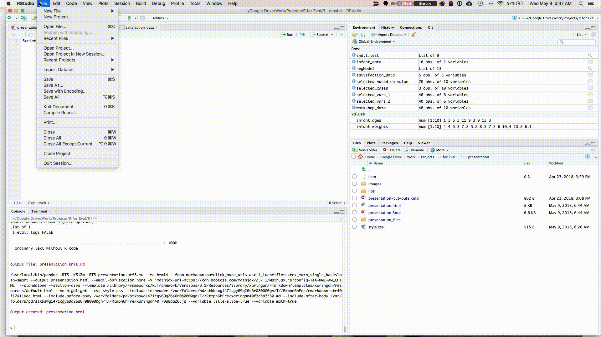
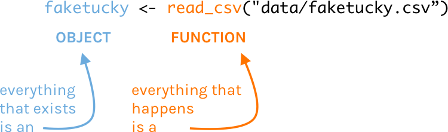

```{r setup, include=FALSE}
options(htmltools.dir.version = FALSE)
knitr::opts_chunk$set(
  fig.width=9, fig.height=3.5, fig.retina=3,
  out.width = "100%",
  cache = FALSE,
  echo = TRUE,
  message = FALSE, 
  warning = FALSE,
  hiline = TRUE
)
```

```{r xaringan-themer, include=FALSE, warning=FALSE}
library(xaringanthemer)
style_duo_accent(
  primary_color = "#1381B0",
  secondary_color = "#FF961C",
  inverse_header_color = "#FFFFFF"
)
```
# Learning Outcomes

# Day 1

- Installation of R and RStudio

- Installation of packages required for the training

- Overview on the R and RStudio layout and menus

- Arithmetic Operations in R

- Data types and data structures in R

- Setting of working directory

- Reading data into R 

- Data Cleaning in R

---
## Install R

The first thing you need to do is download the R software. Go to the **Comprehensive R Archive Network (aka “CRAN”)** **[https://cran.r-project.org]** and download the software for your operating system (Windows, Mac, or Linux).

---
.center[


---
### Working Directly in R
.center[


---

### Working Directly in R

1. Enter: 2 + 2

2. Hit return

3. View result

---


### Your Turn

1. Download and Install R

--

1. Open R

--

1. Use any mathematical operators (+, -, /, and *) to create an expression and make sure it works as expected


---


## RStudio
R Studio is an Integrated Development Environment (IDE) that is running on top of R.
---

### Download RStudio

Download RStudio at the **[RStudio website** **(https://www.rstudio.com/products/rstudio/download/**. Ignore the various versions listed there. All you need is the latest version of RStudio Desktop.
---

.center[


---


### Tour of RStudio

.center[


---
.center[


---

### RStudio

If you use RStudio, you’ll have a integrated development environment (IDE), the ability to see all of your stored information, and much more.
---

.center[


---

### Your Turn

1. Download and Install RStudio

--

1. Open RStudio

--

1. Working in the console pane, use any mathematical operators (+, -, /, and *) to create an expression and make sure it works as expected

---

class: center, middle, dk-section-title

background-image: url("images/projects.jpeg")

# Projects


--

Projects allow you to keep a collection of files all together, including: 

--

- R scripts

--

- RMarkdown files (more on those soon)

--

- Data files

--

- And much more!


---

### Sample Project

.center[


]

---


### How to Create a Project


1. File -> New Project

--

2. Quit RStudio, Double-click .Rproj file to reopen project

---

class:inverse

### Your Turn

1. Create a new project (doesn't matter if it's in a new or existing directory)

--

2. Quit RStudio, double-click the .Rproj file and reopen your project

---


---

# Files in R


## File Types

There are **two main file types** that you'll work with: 

.pull-left[
**R scripts (.R)**
]

--

.pull-right[

**RMarkdown files (.Rmd)**

Text is assumed to be text unless you put it in a code chunk (more on this soon)
---
.center[


]


---

## R Scripts


Create new script file: File -> New File -> R Script
---
.center[



---


## How to Run Code

Run the code: control + enter on Windows,  command + enter on Mac keystrokes or use Run button
---
.center[


???

Note that you don't have to highlight code. 

You can just hit run anywhere on line to run code. 

---


class: center, middle, dk-section-title

background-image: url("images/packages.jpg")

# Packages

---

## Packages

Packages add functionality that is not present in base R. 

They're where much of the power of R is found.

--

.center[


---

## Packages We'll Use throughout this training

.pull-left[

.center[


]

]


.pull-right[

### `tidyverse`

The [`tidyverse`](https://tidyverse.org/) is a collection of packages. 

We'll use [`readr`](https://readr.tidyverse.org/) to import data. 

]

---

## Packages We'll Use


.pull-left[

### `skimr`

[`skimr`](https://github.com/ropensci/skimr) provides easy summary statistics.

]


.pull-right[

.center[


]


]

---


## Install Packages

The syntax to install packages is as follows. 

```{r eval=F}
install.packages("tidyverse")
install.packages("skimr")
```

The package name must be in quotes.

--

.dk-highlight-box[
Packages should be installed **once per computer** (i.e. once you've installed a package, you don't need to do it again on the same computer).
]

---

## Load Packages

To load packages, use the following syntax:

```{r eval = T}
library(tidyverse)
library(skimr)
```

Package names don't need to be quoted here (though they can be).

--

.dk-highlight-box[
Packages should be loaded **once per session** (i.e. every time you start working in R, you need to load any packages you want to use). 
]


---


---


## R is Case Sensitive

R is **case sensitive** so choose one of the following for all objects and **be consistent**.
.pull-left[
**Option**

snake_case 

camelCase

periods.in.names
]

--

.pull-right[

**Example**

student_data

studentData

student.data
]


---


## Directories

If the data file is in the working directory, you only need to specify its name before you can read it into R.


--

If the data file is not in the working directory, you need to specify full path name. 

--

When specifying the path name use of forward slash (“/”) not backslash (“\”).


---

## Where Does our Data Live?

Data we have imported is available in the environment/history pane.

.center[


]

---
# In our next training we will learn how to read data into R.

---
class: center, middle, dk-section-title

background-image: url("images/function.jpg")


# Objects and Functions

---

## Objects and Functions

--

> To understand computations in R, two slogans are helpful:

--

> Everything that exists is an **object**, and 

--

> Everything that happens is a **function** call.

--

John Chambers, quoted in [Hadley Wickham's Advanced R](http://adv-r.had.co.nz/Functions.html).


---

## Objects and Functions

.center[]


---

## Assignment Operator

.center[


]

--

We create an **object** in R by using the assignment opertor ---
class: center, middle, dk-section-title

background-image: url("images/glasses.jpeg")


---

## To learn more about R
## Tidyverse Website

[](https://www.tidyverse.org/)

---


## Package Vignettes

[](https://cran.r-project.org/web/packages/skimr/vignettes/Using_skimr.html)

---

## Twitter

[](https://twitter.com/search?q=%23rstats)

---

## R for Data Science Community

[](https://www.rfordatasci.com/)

---

## Google

[](https://twitter.com/ekaleedmiston/status/1081221822186696706)


