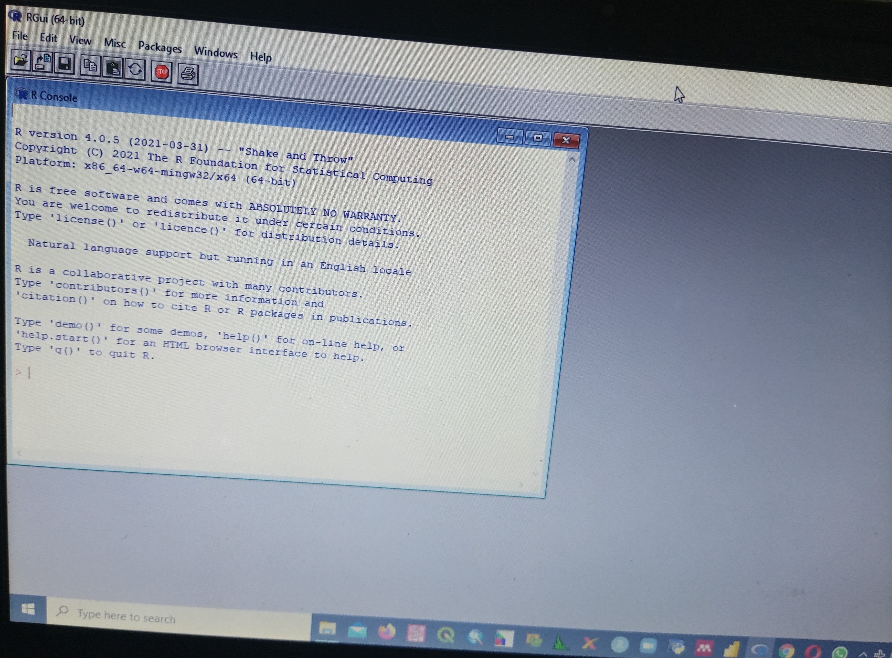

# Installation of R

The first thing you need to do in order to download the R software. Go to the Comprehensive R Archive Network (aka “CRAN”) through the highlighted link here:
**https://cran.r-project.org** 

Download the software for your operating system (Windows, Mac, or Linux).

- Select the version of R for your system e.g Windows, Mac or Linux and then follow the necessary step to install R in your system. After Installation open R, you should see the image below.
---
\newpage

.[center

# Step 2 

### Download RStudio

Download RStudio at the RStudio website:
**https://www.rstudio.com/products/rstudio/download/**

Ignore the various versions listed there. All you need is the latest version of RStudio Desktop. Just copy and paste the highlighted link on your browser and follow the installation guide. Ensure that you select the free version of R Studio.
---

.center[

# After installation open R Studio you should see the image below.

.center[

# Installation of Packages

- Note you can only install a package into R only once but once you want to use a function from that package we have to load the library.

###   Packages to Install   ####

**Just copy the codes below and paste on your console and follow the installation process**

install.packages(c('knitr','skimr','tidyverse','readxl','esquisse','ggThemeAssist','here','devtools'))

